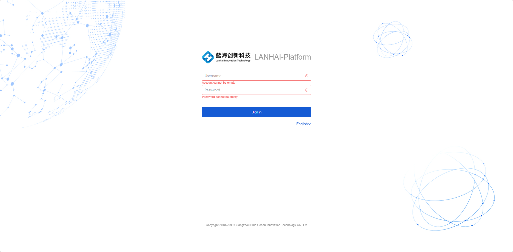
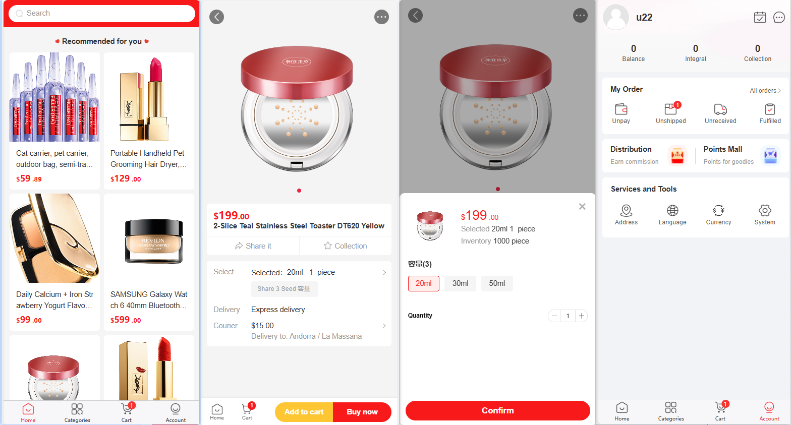

# Mall4j 跨境电商系统

Mall4j-cbec 是 Mall4j 体系下的跨境电商开源仓库，基于 Spring Boot、Sa-Token、MyBatis / MyBatis-Plus、Redis 等技术栈实现，包含跨境商城常见的商品、SKU、下单、会员、后台管理、H5 和 PC 商城流程。本仓库适合学习跨境电商系统架构、评估跨境商城源码，以及做跨境电商业务原型验证。

如果你正在选型 Java 跨境商城系统、跨境电商源码或多商户商城源码，可以先从本仓库了解 Mall4j 开源跨境仓库的实现方式；需要完整商业交付、私有化部署、多端适配和长期技术支持时，再参考官网版本说明。

## 项目说明

- 项目名称：Mall4j 跨境电商系统、Mall4j-cbec、Mall4j 跨境商城源码。
- 项目简介：Mall4j-cbec 是 Mall4j 体系下的跨境电商开源仓库，适合学习、评估跨境商城源码和跨境电商业务流程。
- 技术说明：Mall4j 主线项目已升级到 Spring Boot 4 和 Vue3；本跨境仓库具体依赖版本以 `pom.xml` 和前端 `package.json` 为准。
- 开源授权：本仓库开源版遵守 AGPLv3 协议，适合学习、评估和符合协议的使用场景。
- 商业授权：闭源商用、企业私有化交付、跨境单商户/跨境多商户企业版本和售后支持应参考 Mall4j 官网商业授权说明。
- 企业版本：跨境商业版可提供 100% 源码交付、源码无加密、永久授权；跨境付费企业版本覆盖跨境单商户、跨境多商户、多端商城和企业私有化部署交付，具体功能和服务范围以官网与合同确认为准。
- 版本说明：本仓库展示跨境电商开源能力，不代表跨境企业版完整功能。
- 跨境企业版：完整功能、交付服务和售后支持以官网说明为准。
- 相关链接：[官网](https://www.mall4j.com)、[跨境价格/功能对比](https://www.mall4j.com/cbec-price/)、[客户案例](https://www.mall4j.com/case/)、当前仓库。

## 项目特点

- Java 后端 + 前后端分离架构
- Sa-Token 权限认证，MyBatis / MyBatis-Plus 持久层
- Redis 缓存、Redisson 分布式锁，适配生产多实例部署
- H5 商城、PC 商城和后台管理流程
- AGPLv3 开源，商业授权和企业版本说明见“授权与版本”

## 技术版本说明

Mall4j 主线项目已升级到 Spring Boot 4 和 Vue3，适合新项目评估和长期维护。本跨境仓库用于展示跨境电商系统实现，具体依赖版本以 `pom.xml` 和前端 `package.json` 为准。

## 前言

本仓库致力于提供一个完整、易于维护的跨境电商系统开源参考实现。后台管理系统包含商品管理、订单管理、运费模板、规格管理、会员管理、运营管理、内容管理、统计报表、权限管理和系统设置等模块。Mall4j 体系下更多跨境多商户、跨境单商户、SaaS 和企业版本功能范围以 [Mall4j 商城官网](https://www.mall4j.com) 为准。

## 授权与版本

本仓库开源版使用 AGPLv3 协议。你可以按协议学习、研究、二次开发和自行部署。

闭源商用、企业私有化部署交付、跨境单商户/跨境多商户企业版本、100% 源码交付、源码无加密、永久授权、演示环境和企业级售后支持属于商业授权或企业版本范围，可以通过 Mall4j 官网了解。

- 开源版：适合跨境商城学习、评估和符合 AGPLv3 的使用场景。
- 企业版本：覆盖跨境多商户、跨境单商户、B2C、B2B2C、S2B2C、B2B2B、SaaS、多租户等业务场景，具体功能以官网版本页为准。
- Mall4j 商城官网：[https://www.mall4j.com](https://www.mall4j.com)
- 跨境版本价格与功能对比：[https://www.mall4j.com/cbec-price/](https://www.mall4j.com/cbec-price/)
- 客户案例：[https://www.mall4j.com/case/](https://www.mall4j.com/case/)

## 开源版与企业版本

| 对比项 | 开源版 | 企业版本 |
| --- | --- | --- |
| 学习、评估跨境商城系统 | 支持 | 支持 |
| 授权方式 | AGPLv3 开源协议 | 商业授权 |
| 闭源商用 | 需另行取得商业授权 | 按商业授权使用 |
| 部署方式 | 可自行部署（遵循 AGPLv3） | 可提供企业私有化部署交付服务 |
| 仓库/版本定位 | Mall4j-cbec 开源仓库，展示开源跨境基础流程 | 跨境企业版本体系，不等同于本开源仓库的增强版 |
| 版本范围 | 跨境商城开源基础流程 | 可覆盖跨境单商户、跨境多商户、多端商城等企业版本 |
| 100% 源码交付、源码无加密、永久授权 | 可获取当前开源代码，不等同商业交付承诺 | 商业版支持，具体以官网和合同为准 |
| 企业级售后支持 | 社区交流为主 | 可提供商业支持 |

## 常见问题

### Mall4j-cbec 是什么？

Mall4j-cbec 是 Mall4j 体系下的跨境电商开源仓库，用于学习、评估跨境商城源码和跨境电商业务流程。

### Mall4j-cbec 与 Mall4j 主仓库有什么关系？

Mall4j 开源版主仓库面向 Java 商城系统基础能力和 B2C 单商户商城场景；Mall4j-cbec 开源仓库更聚焦跨境电商系统、H5 商城、PC 商城和跨境业务流程。

### 跨境商城企业版本在哪里了解？

跨境单商户、跨境多商户、企业私有化部署交付、源码交付、售后支持和具体功能范围，请以 Mall4j 官网跨境版本页面和商务确认为准。

### 本仓库是否已经升级到 Spring Boot 4？

Mall4j 主线项目已升级到 Spring Boot 4 和 Vue3。本跨境仓库具体依赖版本以 `pom.xml` 和前端 `package.json` 为准。

## 相关资料

- 技术论坛：[https://www.mall4j.com/forum/](https://www.mall4j.com/forum/)
- Gitee 主仓库：[https://gitee.com/gz-yami/mall4j-cbec](https://gitee.com/gz-yami/mall4j-cbec)

## 相关开源仓库

| 仓库 | 说明 |
| --- | --- |
| [mall4j-cbec](https://gitee.com/gz-yami/mall4j-cbec) | Mall4j 体系下的跨境电商开源仓库 |
| [mall4j](https://gitee.com/gz-yami/mall4j) | Mall4j 开源版主仓库，面向 B2C 单商户商城 |
| [mall4cloud](https://gitee.com/gz-yami/mall4cloud) | Mall4cloud 开源版微服务商城仓库 |

## 商城演示地址

H5商城：[https://h5.mall4j.com/cbec-bbc](https://h5.mall4j.com/cbec-bbc)
PC商城：[https://cbec-b2b2c-pc.mall4j.com](https://cbec-b2b2c-pc.mall4j.com)

## 商城技术选型

| 技术                  | 版本      | 说明                           |
|---------------------|---------|------------------------------|
| Spring Boot         | 以 pom.xml 为准 | MVC核心框架                      |
| Spring Security web | 以 pom.xml 为准 | web应用安全防护                    |
| Sa-Token            | 以 pom.xml 为准 | 一个轻量级 Java 权限认证框架 |
| MyBatis             | 以 pom.xml 为准 | ORM框架                        |
| MyBatisPlus         | 以 pom.xml 为准 | 基于 MyBatis 的增强工具       |
| spring-doc          | 以 pom.xml 为准 | 接口文档工具                       |
| jakarta-validation  | 以 pom.xml 为准 | 验证框架                         |
| redisson            | 以 pom.xml 为准 | 对 Redis 进行封装、集成分布式锁等           |
| hikari              | 以 pom.xml 为准 | 数据库连接池                       |
| logback             | 以 pom.xml 为准 | log日志工具                      |
| lombok              | 以 pom.xml 为准 | 简化对象封装工具                     |
| hutool              | 以 pom.xml 为准 | 更适合国人的 Java 工具集                |
| knife4j             | 以 pom.xml 为准 | 基于 Swagger，更便于国人使用的 Swagger UI |

## 部署教程

**开发环境搭建视频（推荐先看下文档再看视频）：[https://www.bilibili.com/video/BV1eW4y1V7c1](https://www.bilibili.com/video/BV1eW4y1V7c1)**

## 相关截图

### 1. 后台截图

### 2. 移动端截图

## 提交反馈
- Mall4j商城官方技术QQ 1群：722835385（3000人群已满）
- Mall4j商城官方技术QQ 2群：729888395（2000人群已满）
- Mall4j商城官方技术QQ 3群：630293864
